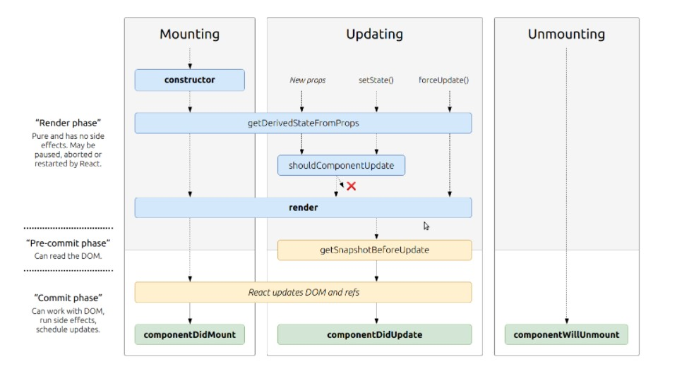

#  Readings: State and Props

1.  Based off the diagram, what happens first, the ‘render’ or the ‘componentDidMount’?
    -  The render
2.  What is the very first thing to happen in the lifecycle of React?
    -  The constructor
3.  Put the following things in the order that they happen: componentDidMount, render, constructor, componentWillUnmount, React Updates
    -  Constructor
    -  Render
    -  React Updates
    -  componentWillUnmount
    -  componentDidMount
4.  What does componentDidMount do?
    -  This method is invoked immediately after a component is mounted. If you need to load anything using a network request or initialize the DOM, it should go here. This method is a good place to set up any subscriptions. If you do that, don’t forget to unsubscribe in componentWillUnmount().
    -  setState() can be called here, but it should be used sparingly, because it will cause a rerender, which can lead to perfomance issues.

###  Example
Here we use componentDidMount() to connect to the YouTube API and get videos when the components is rendered.
        componentDidMount() {
        console.log(‘got videos’);
        this.getVideos(‘cats’);
        }
        getVideos(query) {
        var options = {
        key: this.props.YOUTUBE_API_KEY,
        query: query
        };

##  Additional Resources
-  React Bootstrat Documentation (https://react-bootstrap.github.io/)
-  Netlify (https://www.netlify.com/)

##  Videos - https://www.youtube.com/watch?v=IYvD9oBCuJI
1.  What types of things can you pass in the props?
    -  Things like a function that you want to render to or what you want your component to render like
2.  What is the big difference between props and state?
    -  State is handled inside of the component and can be handled inside the component.  When you change the state, it will re-render the component in that application.  More for items to be displayed.  Static, not going to change.
    -  Props are handled outside of the component and have to be updated outside of the component.  More for items that change or need updating.
3.  When do we re-render our application?
    -  When you change the state
4.  What are some examples of things that we could store in state?
    -  State is for when you have to update and re-render your application based on the user input
    -  Essentially a variable to a function
    -  State is very useful for inside of a form to store what the user selects/enters

##  Bookmark/Skim
React Docs - State and Lifecycle (https://reactjs.org/docs/state-and-lifecycle.html)
React Docs - handling events  (https://reactjs.org/docs/handling-events.html)
React Tutorial through ‘Developer Tools’  (https://reactjs.org/tutorial/tutorial.html)