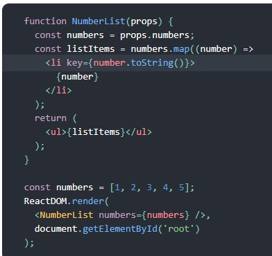

#  Readings: Passing Functions as Props

##  Reading 
###  React Docs - lists and keys (https://reactjs.org/docs/lists-and-keys.html)
Example:

-  Usually you will render lists inside a component
-  A “key” is a special string attribute you need to include when creating lists of elements
1.  What does .map() return?
    -The new array from doubling the original set of numbers
2.  If I want to loop through an array and display each value in JSX, how do I do that in React?
    -  See the screenshot above
3.  Each list item needs a unique ____.
    -  Key
4.  What is the purpose of a key?
    -  Keys let React know which items have changed/been added/been removed

###  The Spread Operator (https://medium.com/coding-at-dawn/how-to-use-the-spread-operator-in-javascript-b9e4a8b06fab)
1.  What is the spread operator?
    -  The spread syntax “spreads” the array into separate arguments when you use ... (three dots)
2.  List 4 things that the spread operator can do.
    -  The spread operator is useful for many different routine tasks in JavaScript, including the following:
        -  Copying an array
        -  Concatenating or combining arrays
        -  Using Math functions
        -  Using an array as arguments
        -  Adding an item to a list
        -  Adding to state in React
        -  Combining objects
        -  Converting NodeList to an array
3.  Give an example of using the spread operator to combine two arrays.
    -  const hello = {hello: "😋😛😜🤪😝"}
    -  const world = {world: "🙂🙃😉😊😇🥰😍🤩!"}

    -  const helloWorld = {...hello,...world}
    -  console.log(helloWorld) // Object { hello: "😋😛😜🤪😝", world: "🙂🙃😉😊😇🥰😍🤩!" }

4.  Give an example of using the spread operator to add a new item to an array.
    -  
5.  Give an example of using the spread operator to combine two objects into one.
    -

## Videos
### How to Pass Functions Between Components(https://www.youtube.com/watch?v=c05OL7XbwXU)
1.  In the video, what is the first step that the developer does to pass functions between components?
    -
2.  In your own words, what does the increment function do?
    -
3.  How can you pass a method from a parent component into a child component?
    -
4.  How does the child component invoke a method that was passed to it from a parent component?
    -

##  Bookmark/Skim
-  React Tutorial through ‘Declaring a Winner’ (https://reactjs.org/tutorial/tutorial.html)
-  React Docs - Lifting State Up (https://reactjs.org/docs/lifting-state-up.html)