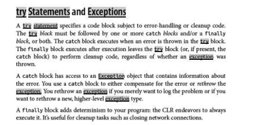

#  Readings: Exception Handling

##  Reading
1.  Debugging for absolute beginners  https://docs.microsoft.com/en-us/visualstudio/debugger/debugging-absolute-beginners?view=vs-2019
    -  
2.  Try/Catch Blocks https://docs.microsoft.com/en-us/dotnet/standard/exceptions/how-to-use-the-try-catch-block-to-catch-exceptions
    -  
3.  Exception Handling  https://docs.microsoft.com/en-us/dotnet/csharp/language-reference/keywords/exception-handling-statements
    -  
4.  C# 7.0 in a Nutshell - pg. 158 - 166 (start @ “try Statements and Exceptions)  https://www.amazon.com/C-9-0-Nutshell-Definitive-Reference/dp/1098100964/ref=sr_1_3?crid=3CG3JTL9M1WXQ&dchild=1&keywords=c+9.0+in+a+nutshell&qid=1633047607&sprefix=c%23+9.0+in+a%2Caps%2C1359&sr=8-3&asin=1098100964&revisionId=&format=4&depth=1
    -  Try/Catch & Exceptions excerpt from assigned book (introduction)

5.  Therac-25  https://en.wikipedia.org/wiki/Therac-25
    -  
6.  Ariane 5  https://en.wikipedia.org/wiki/Ariane_5
    -  