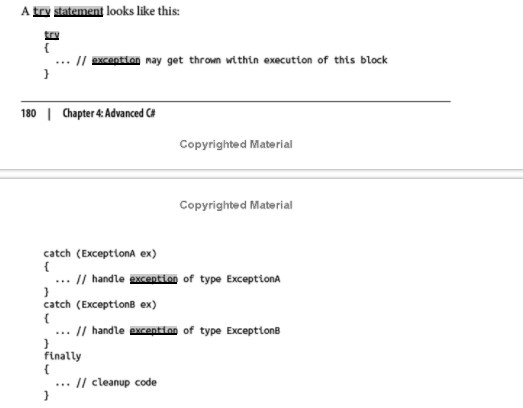

#  Readings: Exception Handling

##  Reading
1.  Debugging for absolute beginners  https://docs.microsoft.com/en-us/visualstudio/debugger/debugging-absolute-beginners?view=vs-2019
    -  Debugging means to run your code step by step in a debugging tool like Visual Studio, to find the exact point where you made a programming mistake
    -  Clarify the problem by asking yourself the right questions
        -  So, before you start debugging, make sure you've identified the problem you're trying to solve:
            -  What did you expect your code to do?
            -  What happened instead?
            -  An exception is an unexpected event encountered when running code, typically an error of some kind. A debugging tool can take you to the exact place in your code where the exception occurred and can help you investigate possible fixes.
            -  By stepping through the code in a debugger, you can examine each and every change to your variables to discover exactly when and how incorrect values are assigned.
    -  Examine your assumptions
        -  Before you investigate a bug or an error, think of the assumptions that made you expect a certain result
        -  Here are a few questions to ask yourself to challenge your assumptions.
            -  Are you using the right API (that is, the right object, function, method, or property)? An API that you're using might not do what you think it does. (After you examine the API call in the debugger, fixing it may require a trip to the documentation to help identify the correct API.)

            -  Are you using an API correctly? Maybe you used the right API but didn't use it in the right way.

            -  Does your code contain any typos? Some typos, like a simple misspelling of a variable name, can be difficult to see, especially when working with languages that don’t require variables to be declared before they’re used.

            -  Did you make a change to your code and assume it is unrelated to the problem that you're seeing?

            -  Did you expect an object or variable to contain a certain value (or a certain type of value) that's different from what really happened?

            -  Do you know the intent of the code? It is often more difficult to debug someone else's code. If it's not your code, it's possible you might need to spend time learning exactly what the code does before you can debug it effectively.
    -  Step through your code in debugging mode to find where the problem occurred
        -  Running an app within a debugger, also called debugging mode, means that the debugger actively monitors everything that’s happening as the program runs
        -  It also allows you to pause the app at any point to examine its state, and to then step through your code line by line to watch every detail as it happens
    -  There is a sample program that can be copied, run through the debugger, and fixed at the link for this article - very specific and provides examples
2.  Try/Catch Blocks https://docs.microsoft.com/en-us/dotnet/standard/exceptions/how-to-use-the-try-catch-block-to-catch-exceptions
    -  Place any code statements that might raise or throw an exception in a try block, and place statements used to handle the exception or exceptions in one or more catch blocks below the try block
    -  Each catch block includes the exception type and can contain additional statements needed to handle that exception type
3.  Exception Handling  https://docs.microsoft.com/en-us/dotnet/csharp/language-reference/keywords/exception-handling-statements
    -  throw - https://docs.microsoft.com/en-us/dotnet/csharp/language-reference/keywords/throw
    -  try-catch - https://docs.microsoft.com/en-us/dotnet/csharp/language-reference/keywords/try-catch
    -  try-finally - https://docs.microsoft.com/en-us/dotnet/csharp/language-reference/keywords/try-finally
    -  try-catch-finally - https://docs.microsoft.com/en-us/dotnet/csharp/language-reference/keywords/try-catch-finally
4.  C# 7.0 in a Nutshell - pg. 158 - 166 (start @ “try Statements and Exceptions)  https://www.amazon.com/C-9-0-Nutshell-Definitive-Reference/dp/1098100964/ref=sr_1_3?crid=3CG3JTL9M1WXQ&dchild=1&keywords=c+9.0+in+a+nutshell&qid=1633047607&sprefix=c%23+9.0+in+a%2Caps%2C1359&sr=8-3&asin=1098100964&revisionId=&format=4&depth=1
    -  Try/Catch & Exceptions excerpt from assigned book (introduction)

5.  Therac-25  https://en.wikipedia.org/wiki/Therac-25
    -  The Therac-25 was a computer-controlled radiation therapy machine produced by Atomic Energy of Canada Limited (AECL) in 1982 after the Therac-6 and Therac-20 units (the earlier units had been produced in partnership with CGR of France)
    -  It was involved in at least six accidents between 1985 and 1987, in which patients were given massive overdoses of radiation
    -  Leveson notes that a lesson to be drawn from the incident is to not assume that reused software is safe:[6] "A naive assumption is often made that reusing software or using commercial off-the-shelf software will increase safety because the software will have been exercised extensively. Reusing software modules does not guarantee safety in the new system to which they are transferred..."[3] This blind faith in poorly understood software coded paradigms is known as cargo cult programming. In response to incidents like those associated with Therac-25, the IEC 62304 standard was created, which introduces development life cycle standards for medical device software and specific guidance on using software of unknown pedigree.[7]
6.  Ariane 5  https://en.wikipedia.org/wiki/Ariane_5
    -  Ariane 5 is a European heavy-lift space launch vehicle developed and operated by Arianespace for the European Space Agency (ESA)
    -  Ariane 5's first test flight (Ariane 5 Flight 501) on 4 June 1996 failed, with the rocket self-destructing 37 seconds after launch because of a malfunction in the control software.[35] 
    -  A data conversion from 64-bit floating point value to 16-bit signed integer value to be stored in a variable representing horizontal bias caused a processor trap (operand error)[36] because the floating point value was too large to be represented by a 16-bit signed integer