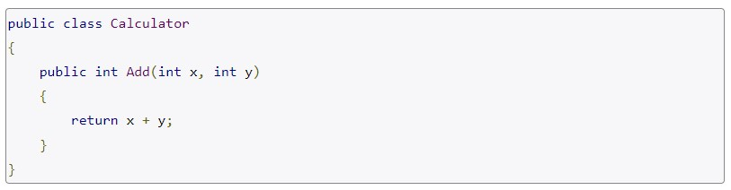
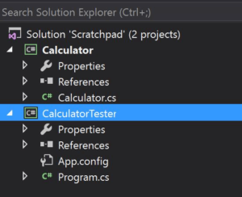
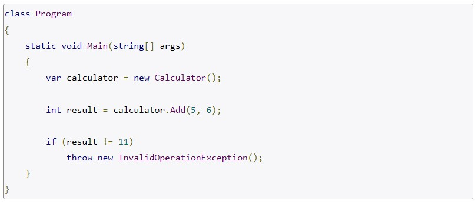
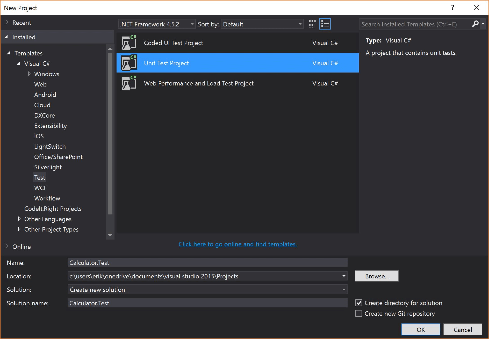
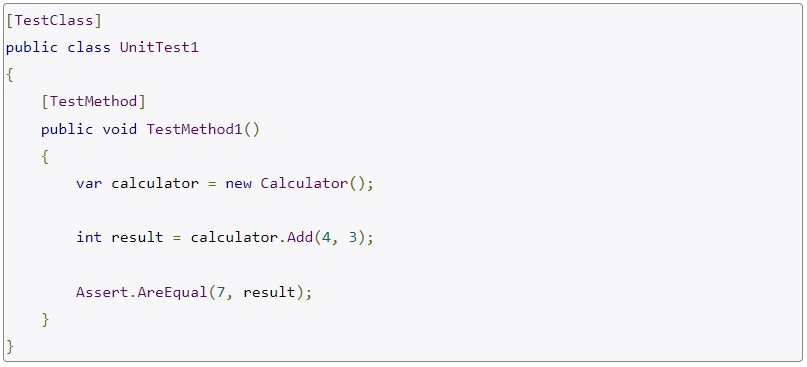
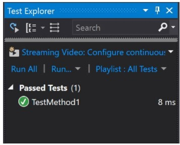
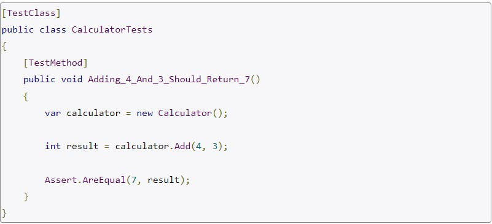

#  Readings: Unit Testing and Documentation

##  Readings
1.  Unit Testing Best Practices *Not in Xunit, but concepts are still true  https://stackify.com/unit-testing-basics-best-practices/
    -  Not every test you could conceivably write qualifies as a unit test
    -  Unit tests don’t deal with their environment and with external systems to the codebase
    -  If it you’ve written something that can fail when run on a machine without the “proper setup,” you haven’t written a unit test
    -  If you create some sort of test that throws thousands of requests for a service you’ve written, that qualifies as a smoke test and not a unit test
    -  If you have a console application and you pipe input to it from the command line and test for output, you’re executing an end-to-end system test — not a unit test
    -  Make no mistake — tests that do these things add value.  They should be part of your general approach to code quality.  They just don’t fall under the heading of unit tests.
    -  Unit tests isolate and exercise specific units of your code
        -  In C#, you can think of a unit as a method
            -  You thus write a unit test by writing something that tests a method
            -  Oh, and it tests something specific about that method in isolation
        Ex.

    -  We have a single class, Calculator, in a class library project
    -  Using a new counsole project, give it a reference to the project that has the calculator

    -  Now, let’s do the following in the main of the Calculator Tester

    -  Congratulations!  You’ve just written one extremely clunky unit test!
-  Unit Test Framwork
    1.  Right-click on the solution to add a project, and choose the “Unit Test Project Template” after selecting “Test”.

    2.  Add the project reference to Calculator again, and then take a look at the class it created for you, called “UnitTest1.”

    3.  Click Ctrl-R, T to run it, and look what happens

-  We want to name our test methods in a very descriptive way that indicates our hypothesis as to what inputs should create what outputs
-  Notice the TestMethod attribute above this method
-  This tells MSTest to consider this a test method.
-  If you removed the attribute and re-ran the unit tests in the codebase, MSTest would ignore this method
-  You need to decorate any test classes and test methods this way to make MSTest execute them.

-  Finally, consider the static method Assert.AreEqual
-  Microsoft supplies a UnitTesting namespace with this Assert class in it
-  You use this class’s various methods as the final piece in the MSTest puzzle
-  Assertion passes and fails determine whether the test passes or fails as seen in the test runner
    -  (As an aside, if you generate an unhandled exception in the test, that constitutes a failure, and if you never assert anything, that constitutes a pass.)
###  Unit Testing Best Practices
    1.  Arrange, Act, Assert
        -  First, we arrange everything we need to run the experiment
        -  With the arranging in place, we act.  In this case, we invoke the add method and capture the result.
        -  the assert concept in the unit test represents a general category of action that you cannot omit and have a unit test.  It asserts the hypothesis itself.  Asserting something represents the essence of testing.
    2.  One Assert Per Test Method
    3.  Avoid Test Interdependence
        -  Each test should handle its own setup and tear down
    4.  Keep It Short, Sweet, and Visible
        -  When a test fails, you want to understand what went wrong
    5.  Recognize Test Setup Pain as a Smell
    6.  Add Them to the Build

2.  XUnit Documentation  http://xunit.github.io/#documentation
    -  Status 404 on link
3.  Art of Readme  https://github.com/noffle/art-of-readme
    -  The intent is clear: "This is important information for the user to read before proceeding."
    -  If a module has no human available to answer questions and explain what a module does, combined with no remnants of documentation left behind, a module becomes a bizarre alien artifact, unusable and incomprehensible by the archaeologist-hackers of tomorrow
    -  Writing excellent documentation is all about keeping the users out of the source code by providing instructions sufficient to enjoy the wonderful abstractions that your module brings
    -  Some experienced Node developers band together to create curated lists of quality modules - https://github.com/sindresorhus/awesome-nodejs
    -  How about the social graph? This idea spurred the creation of node-modules.com, a npm search replacement that leverages your GitHub social graph to find modules your friends like or have made - http://node-modules.com/
    -  Of course there is also npm's built-in search functionality: a safe default, and the usual port of entry for new developers - https://npmjs.org/
    -  You must explain exactly what need your module fills, and how effectively it does so.
        -  Your job is to:
            1.  tell them what it is (with context)
            2.  show them what it looks like in action
            3.  show them how they use it
            4.  tell them any other relevant details
    -  Brevity - Detailed documentation is good -- make separate pages for it! -- but keep your README succinct
    -  Learn from the past - It is said that those who do not study their history are doomed to make its mistakes again
    -  No README? No abstraction - The Perl monks have wisdom to share on the matter:

> Your documentation is complete when someone can use your module without ever having to look at its code. This is very important. > This makes it possible for you to separate your module's documented interface from its internal implementation (guts). This is > > good because it means that you are free to change the module's internals as long as the interface remains the same.
> 
> Remember: the documentation, not the code, defines what a module does. -- Ken Williams
    -  Key elements (top to bottom):
        1.  Name -- self-explanatory names are best. collide-2d-aabb-aabb sounds promising, though it assumes I know what an "aabb" is. If the name sounds too vague or unrelated, it may be a signal to move on.

        2.  One-liner -- having a one-liner that describes the module is useful for getting an idea of what the module does in slightly greater detail. collide-2d-aabb-aabb says it
            -  Determines whether a moving axis-aligned bounding box (AABB) collides with other AABBs.

            -  Awesome: it defines what an AABB is, and what the module does. Now to gauge how well it'd fit into my code:

        3.  Usage -- rather than starting to delve into the API docs, it'd be great to see what the module looks like in action. I can quickly determine whether the example JS fits the desired style and problem. People have lots of opinions on things like promises/callbacks and ES6. If it does fit the bill, then I can proceed to greater detail.

        4.  API -- the name, description, and usage of this module all sound appealing to me. I'm very likely to use this module at this point. I just need to scan the API to make sure it does exactly what I need and that it will integrate easily into my codebase. The API section ought to detail the module's objects and functions, their signatures, return types, callbacks, and events in detail. Types should be included where they aren't obvious. Caveats should be made clear.

        5.  Installation -- if I've read this far down, then I'm sold on trying out the module. If there are nonstandard installation notes, here's where they'd go, but even if it's just a regular npm install, I'd like to see that mentioned, too. New users start using Node all the time, so having a link to npmjs.org and an install command provides them the resources to figure out how Node modules work.

        6.  License -- most modules put this at the very bottom, but this might actually be better to have higher up; you're likely to exclude a module VERY quickly if it has a license incompatible with your work. I generally stick to the MIT/BSD/X11/ISC flavours. If you have a non-permissive license, stick it at the very top of the module to prevent any confusion.
    -  Cognitive funneling - The ordering presented here is lovingly referred to as "cognitive funneling," and can be imagined as a funnel held upright, where the widest end contains the broadest more pertinent details, and moving deeper down into the funnel presents more specific details that are pertinent for only a reader who is interested enough in your work to have reached that deeply in the document
    -  Care about people's time - Your only job is to describe its promise as succinctly as you can, so module spelunkers can either use your work when it's a fit, or move on to something else that does
-  Theory is well and good, but what do excellent READMEs look like? Here are some that I think embody the principles of this article well:

    -  https://github.com/noffle/ice-box
    -  https://github.com/substack/quote-stream
    -  https://github.com/feross/bittorrent-dht
    -  https://github.com/mikolalysenko/box-intersect
    -  https://github.com/freeman-lab/pixel-grid
    -  https://github.com/mafintosh/torrent-stream
    -  https://github.com/pull-stream/pull-stream
    -  https://github.com/substack/tape
    -  https://github.com/yoshuawuyts/vmd
-  A helpful checklist to gauge how your README is coming along:

    - [[]] One-liner explaining the purpose of the module
    - [ ] Necessary background context & links
    - [ ] Potentially unfamiliar terms link to informative sources
    - [ ] Clear, runnable example of usage
    - [ ] Installation instructions
    - [ ] Extensive API documentation
    - [ ] Performs cognitive funneling
    - [ ] Caveats and limitations mentioned up-front
    - [ ] Doesn't rely on images to relay critical information
    - [ ] License
-  Further Reading
    -  README-Driven Development  http://tom.preston-werner.com/2010/08/23/readme-driven-development.html
    -  Documentation First http://joeyh.name/blog/entry/documentation_first/
4.  ReadMe Best Practices  https://github.com/jehna/readme-best-practices
    -  Getting started
        -  Copy the README-default.md file for yourself and start editing! At the root of your project, run:
        -  curl https://raw.githubusercontent.com/jehna/readme-best-practices/master/README-default.md > README.md
        -  The code above fetches the README-default.md file from this repository and renames it to README.md.
    -  Fill with your own text
        -  atom README.md
        -  If you're using Atom code editor, the code above opens the file for editing. If necessary, substitute with your preferred markdown editor
    -  Add to git and push
    -  Features
        -  This project makes it easy to:
            -  Bootstrap your open source project properly
            -  Make sure everyone gets what you're trying to achieve with your project
            -  Follow simple instructions for a perfect README.md
    -  Related projects
        -  Billie Thompson's README template  https://gist.github.com/PurpleBooth/109311bb0361f32d87a2
        -  A list of awesome READMEs  https://github.com/matiassingers/awesome-readme
        -  Akash Nimare's kickass README guide  https://gist.github.com/akashnimare/7b065c12d9750578de8e705fb4771d2f
        -  Dan Bader's README template  https://github.com/dbader/readme-template