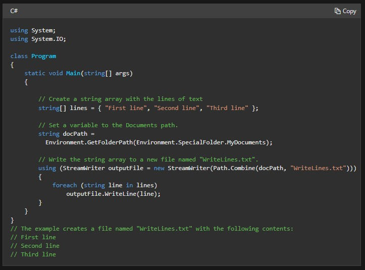
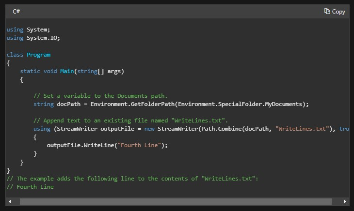
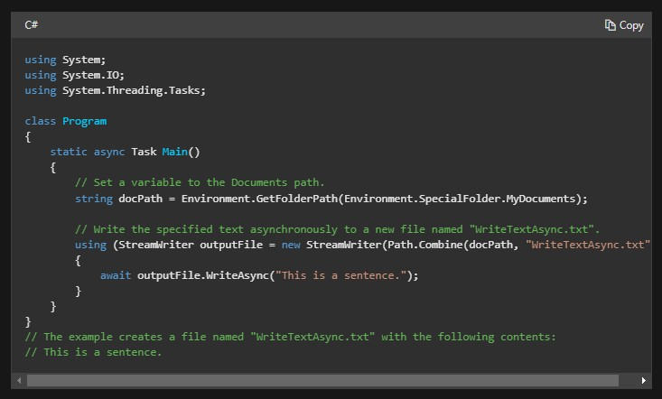
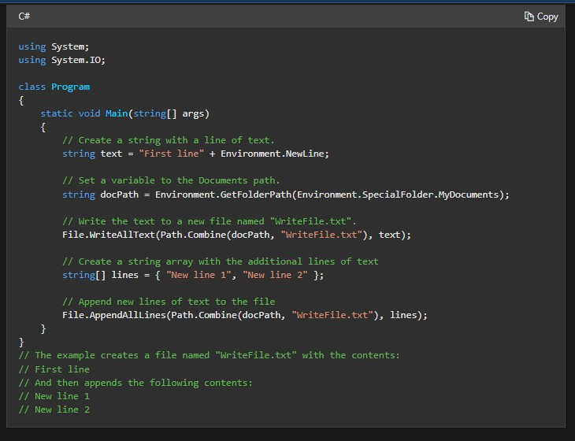
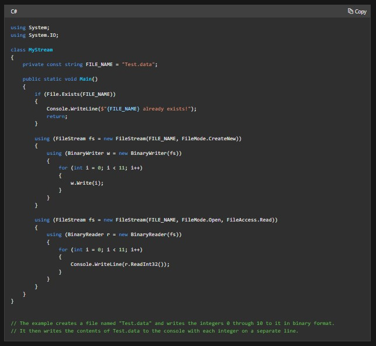

#  Readings: File Manipulation / System.IO

##  Readings
1.  File and Stream I/O  https://docs.microsoft.com/en-us/dotnet/standard/io/
    -  File and stream I/O (input/output) refers to the transfer of data either to or from a storage medium
    -  In .NET, the System.IO namespaces contain types that enable reading and writing, both synchronously and asynchronously, on data streams and files
    -  These namespaces also contain types that perform compression and decompression on files, and types that enable communication through pipes and serial ports
    ### Files and Directories
    -  Here are some commonly used file and directory classes:
        -  File - provides static methods for creating, copying, deleting, moving, and opening files, and helps create a FileStream object
        -  FileInfo - provides instance methods for creating, copying, deleting, moving, and opening files, and helps create a FileStream object
        -  Directory - provides static methods for creating, moving, and enumerating through directories and subdirectories.
        -  DirectoryInfo - provides instance methods for creating, moving, and enumerating through directories and subdirectories.
        -  Path - provides methods and properties for processing directory strings in a cross-platform manner
    ### Streams
    -  The abstract base class Stream supports reading and writing bytes. All classes that represent streams inherit from the Stream class
    -  The Stream class and its derived classes provide a common view of data sources and repositories, and isolate the programmer from the specific details of the operating system and underlying devices
    -  Streams involve three fundamental operations:
        -  Reading - transferring data from a stream into a data structure, such as an array of bytes
        -  Writing - transferring data to a stream from a data source
        -  Seeking - querying and modifying the current position within a stream
    -  Here are some commonly used stream classes:
        -  FileStream – for reading and writing to a file.
        -  IsolatedStorageFileStream – for reading and writing to a file in isolated storage.
        -  MemoryStream – for reading and writing to memory as the backing store.
        -  BufferedStream – for improving performance of read and write operations.
        -  NetworkStream – for reading and writing over network sockets.
        -  PipeStream – for reading and writing over anonymous and named pipes.
        -  CryptoStream – for linking data streams to cryptographic transformations.
        -  For an example of working with streams asynchronously, see Asynchronous File I/O.  
    ### Readers and Writers
    -  The reader and writer types handle the conversion of the encoded characters to and from bytes so the stream can complete the operation
    -  Here are some commonly used reader and writer classes:
        -  BinaryReader and BinaryWriter – for reading and writing primitive data types as binary values.
        -  StreamReader and StreamWriter – for reading and writing characters by using an encoding value to convert the characters to and from bytes.
        -  StringReader and StringWriter – for reading and writing characters to and from strings.
        -  TextReader and TextWriter – serve as the abstract base classes for other readers and writers that read and write characters and strings, but not binary data.
    ###  Asynchronous I/O operations
    -  Reading or writing a large amount of data can be resource-intensive
    -  You should perform these tasks asynchronously if your application needs to remain responsive to the user
    -  With synchronous I/O operations, the UI thread is blocked until the resource-intensive operation has completed
    ### Compression
    -  Compression refers to the process of reducing the size of a file for storage
    -  The following classes are frequently used when compressing and decompressing files and streams:
        -  ZipArchive – for creating and retrieving entries in the zip archive.
        -  ZipArchiveEntry – for representing a compressed file.
        -  ZipFile – for creating, extracting, and opening a compressed package.
        -  ZipFileExtensions – for creating and extracting entries in a compressed package.
        -  DeflateStream – for compressing and decompressing streams using the Deflate algorithm.
        -  GZipStream – for compressing and decompressing streams in gzip data format.
    ###  Isolated Storage
    -  Isolated storage is a data storage mechanism that provides isolation and safety by defining standardized ways of associating code with saved data
    -  The following classes are frequently used when implementing isolated storage:
        -  IsolatedStorage – provides the base class for isolated storage implementations.
        -  IsolatedStorageFile – provides an isolated storage area that contains files and directories.
        -  IsolatedStorageFileStream - exposes a file within isolated storage
    ###  I/O operations in Windows Store apps
    -  .NET for Windows 8.x Store apps contains many of the types for reading from and writing to streams; however, this set does not include all the .NET I/O types.
    -  Some important differences to note when using I/O operations in Windows 8.x Store apps:
        -  Types specifically related to file operations, such as File, FileInfo, Directory and DirectoryInfo, are not included in the .NET for Windows 8.x Store apps. Instead, use the types in the Windows.Storage namespace of the Windows Runtime, such as StorageFile and StorageFolder.
        -  Isolated storage is not available; instead, use application data.
        -  Use asynchronous methods, such as ReadAsync and WriteAsync, to prevent blocking the UI thread.
        -  The path-based compression types ZipFile and ZipFileExtensions are not available. Instead, use the types in the Windows.Storage.Compression namespace.
    -  You can convert between .NET Framework streams and Windows Runtime streams, if necessary
    ###  I/O and security
    -  When you use the classes in the System.IO namespace, you must follow operating system security requirements such as access control lists (ACLs) to control access to files and directories
2.  Write to a file  https://docs.microsoft.com/en-us/dotnet/standard/io/how-to-write-text-to-a-file
    -  The following classes and methods are typically used to write text to a file:
        -  StreamWriter contains methods to write to a file synchronously (Write and WriteLine) or asynchronously (WriteAsync and WriteLineAsync).
        -  File provides static methods to write text to a file, such as WriteAllLines and WriteAllText, or to append text to a file, such as AppendAllLines, AppendAllText, and AppendText.
        -  Path is for strings that have file or directory path information. It contains the Combine method and, in .NET Core 2.1 and later, the Join and TryJoin methods, which allow concatenation of strings to build a file or directory path.

3.  Read to a file  https://docs.microsoft.com/en-us/dotnet/standard/io/how-to-read-and-write-to-a-newly-created-data-file
    -  The System.IO.BinaryWriter and System.IO.BinaryReader classes are used for writing and reading data other than character strings. The following example shows how to create an empty file stream, write data to it, and read data from it
    - The example creates a data file called Test.data in the current directory, creates the associated BinaryWriter and BinaryReader objects, and uses the BinaryWriter object to write the integers 0 through 10 to Test.data, which leaves the file pointer at the end of the file
    -  The BinaryReader object then sets the file pointer back to the origin and reads out the specified content

