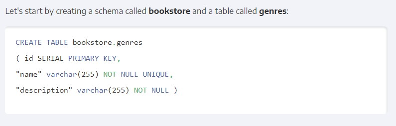
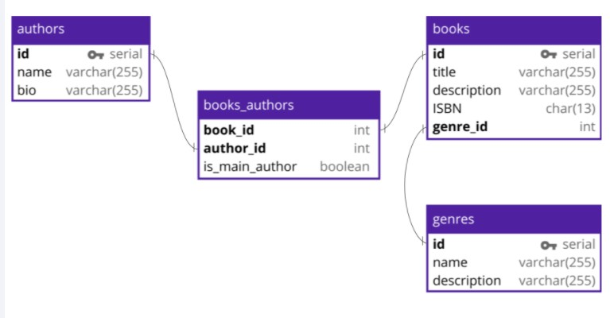

#  Readings: Introduction to Databases and ERD

##  Readings
1.  Data Models (Review the DB Schema)  https://docs.microsoft.com/en-us/aspnet/core/data/ef-mvc/complex-data-model?view=aspnetcore-2.0
2.  DBMS  https://www.tutorialspoint.com/dbms/dbms_overview.htm
3.  Do some research on what a Database Schema is  https://en.wikipedia.org/wiki/Database_schema
    -  What is a Schema?  
        -  The term "schema" refers to the organization of data as a blueprint of how the database is constructed (divided into database tables in the case of relational databases)
        -  The formal definition of a database schema is a set of formulas (sentences) called integrity constraints imposed on a database
    -  Why do we use them?  https://www.xplenty.com/blog/complete-guide-to-database-schema-design-guide/
        -  By defining categories of data and relationships between those categories, database schema design makes data much easier to retrieve, consume, manipulate, and interpret
    -  What do they look like?  https://blog.panoply.io/database-schema-design-examples

4.  What are the different types of Database Keys?
    -  What is a Primary Key?
        -  The unique identifier to ensure that every item in the database is distinct
    -  What is a Foreign Key?  https://blog.panoply.io/database-schema-design-examples
        -  Foreign keys are what allow us to connect tables together

    -  What is a Composite Key?  https://en.wikipedia.org/wiki/Composite_key#:~:text=In%20database%20design%2C%20a%20composite,key%20in%20its%20own%20right.
        -  A composite key is a candidate key that consists of two or more attributes (table columns) that together uniquely identify an entity occurrence (table row)
    -  How are they different? When do you use 1 over the others?
5.  What are Relationships in a relational database?  https://www.lucidchart.com/pages/database-diagram/database-design
    -  What is a 1:1 relationship?  
        -  When there’s only one instance of Entity A for every instance of Entity B, they are said to have a one-to-one relationship (often written 1:1)
    -  What is a Many:Many relationship?
        -  When multiple entities from a table can be associated with multiple entities in another table, they are said to have a many-to-many (M:N) relationship
    -  How about a 1: Many or a Many:1?
        -  These relationships occur when a record in one table is associated with multiple entries in another