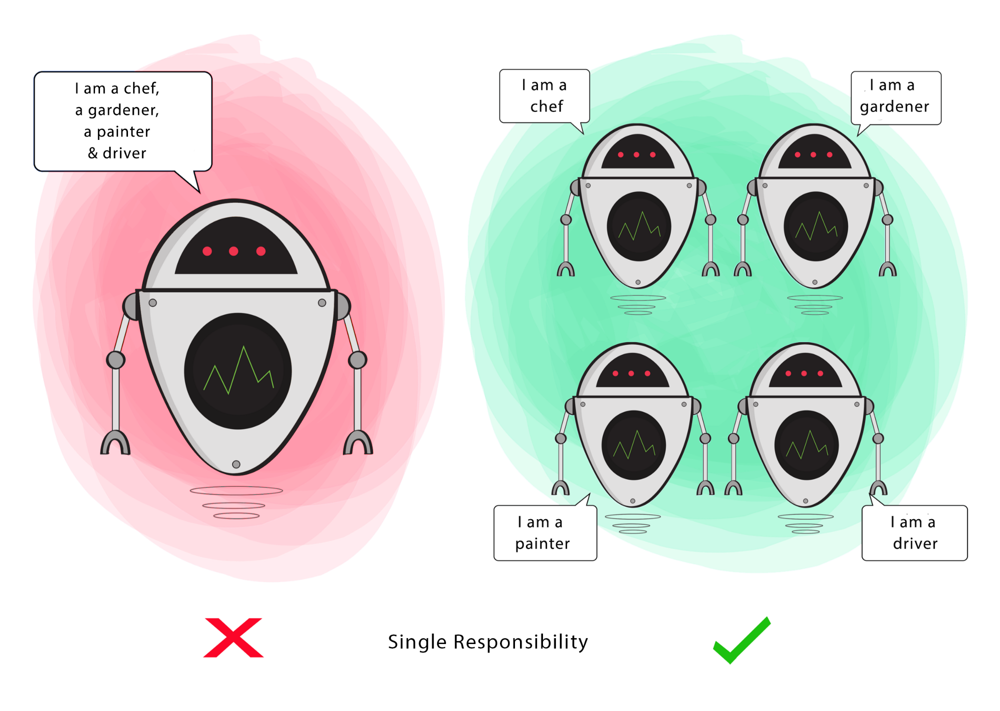

#  Readings: Dependency Injection & Repository Design Pattern

##  Readings

1.  Dependency Injection  https://docs.microsoft.com/en-us/aspnet/core/fundamentals/dependency-injection
    -  ASP.NET Core supports the dependency injection (DI) software design pattern, which is a technique for achieving Inversion of Control (IoC) between classes and their dependencies
    -  A dependency is an object that another object depends on
    -  Dependency injection addresses these problems through:
        -  The use of an interface or base class to abstract the dependency implementation.
        -  Registration of the dependency in a service container. ASP.NET Core provides a built-in service container, IServiceProvider. Services are typically registered in the app's Startup.ConfigureServices method.
        -  Injection of the service into the constructor of the class where it's used. The framework takes on the responsibility of creating an instance of the dependency and disposing of it when it's no longer needed.
    -  Services can be injected into the Startup constructor and the Startup.Configure method
    -  Includes examples
2.  Repository Pattern  https://docs.microsoft.com/en-us/aspnet/core/fundamentals/repository-pattern?view=aspnetcore-2.1
    -  Repositories are classes or components that encapsulate the logic required to access data sources
    -  The Repository pattern is a well-documented way of working with a data source
    >A repository performs the tasks of an intermediary between the domain model layers and data mapping, acting in a similar way to a set of domain objects in memory. Client objects declaratively build queries and send them to the repositories for .answers. Conceptually, a repository encapsulates a set of objects stored in the database and operations that can be performed on them, providing a way that is closer to the persistence layer. Repositories, also, support the purpose of separating, >clearly and in one direction, the dependency between the work domain and the data allocation or mapping.
3.  Repository Design Pattern  https://medium.com/@pererikbergman/repository-design-pattern-e28c0f3e4a30
    -  ...the repository pattern have two purposes; first it is an abstraction of the data layer and second it is a way of centralising the handling of the domain objects
    - Provides examples of creating the interface
4.  SOLID Principles  https://www.telerik.com/blogs/30-days-of-tdd-day-five-make-your-code-solid
    -  The SOLID Principals of software development is the brain child or Robert “Uncle Bob” Martin. In the early 2000 he described five principals that software developers could use to guide them in creating software that was well designed, high quality and easier to maintain than what was being produced at the time. These five ideas are simple, promote good practices in software design and development, and go a long way to help us in our practice of TDD.
        1.  The Single Responsibility Principal (SRP) is the idea that every method or class in your application should have exactly one reason to change
        2.  The Open/Close Principle (OCP) is very closely related to the previously discussed topics of Encapsulation and Inheritance.  OCP states that software, be it a method or a class, should be open for extension, but closed to modification
        3.  The Liskov Substitution Principle (LSP) states that an object in your application should be able to be replaced with a type derived from it without breaking the application
        4.  The Interface Segregation Principle states that clients should not be forced to rely on interfaces they do not use
        5.  This is where the Dependency Inversion Principle (DIP) comes into play. The DIP is the idea that code should depend on abstractions; not concrete implementations
5.  Why SOLID Matters  https://www.telerik.com/blogs/why-solid-matters
    1.  Code that does too much is very much like that Swiss Army knife – trying to be all things to all scenarios results in overly complex and fragile code.  Keeping your methods short and of singular purpose brings clarity and ease of maintainability to your software
    2.  Just as you wouldn’t want to add a basement to a finished house, making modifications to fundamental parts of code significantly increases the chance of introducing bugs or side effects.  It is better to use extensions (like adding a patio room) to add on to or alter functionality of a module through polymorphism than to continually edit the base code by adding switch statements
    3.  Just as you wouldn’t want to add a basement to a finished house, making modifications to fundamental parts of code significantly increases the chance of introducing bugs or side effects.  It is better to use extensions (like adding a patio room) to add on to or alter functionality of a module through polymorphism than to continually edit the base code by adding switch statements
    4.  Just like in Visual Studio where you can pick you development profile (C#, VB.NET), your classes should tailor their interfaces to the clients that consume them.  Fine grained interfaces reduce the analysis paralysis that can occur when there are too many choices
    5.  For those of you who drive, do you have to build your car every time you go to work?  Can you drive more than one different car, or can you only drive one physical instance of a car?  Have you ever borrowed a car (or rented one?).  Think of this in your software.  When your code instantiates a concrete class and then uses that instance, it completely depends on that particular implementation, and will never be able to use another one until you change how the code is written.  However, if you code to an Interface, you can borrow a car, rent a car, or buy a new one!
    -  Includes class examples
6.  SOLID Principles in Pictures  https://medium.com/backticks-tildes/the-s-o-l-i-d-principles-in-pictures-b34ce2f1e898

