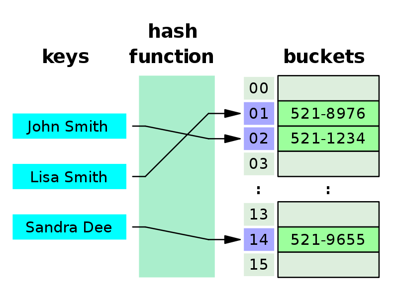
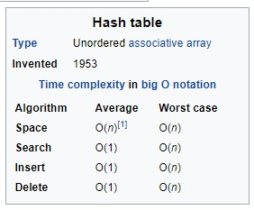

#  Implementation: Hash Tables

## Resources
1.  Read Intro to Hash Tables  https://codefellows.github.io/common_curriculum/data_structures_and_algorithms/Code_401/class-30/resources/Hashtables.html
    -  What is a Hashtable?
        -  Terminology:
            1.  Hash - A hash is the result of some algorithm taking an incoming string and converting it into a value that could be used for either security or some other purpose. In the case of a hashtable, it is used to determine the index of the array.
            2.  Buckets - A bucket is what is contained in each index of the array of the hashtable. Each index is a bucket. An index could potentially contain multiple key/value pairs if a collision occurs.
            3.  Collisions - A collision is what happens when more than one key gets hashed to the same location of the hashtable.
    -  Why do we use them?
        -  Hold unique values
        -  Dictionary
        -  Library
    -  What Are they
        -  Hashtables are a data structure that utilize key value pairs. This means every Node or Bucket has both a key, and a value.
        -  The basic idea of a hashtable is the ability to store the key into this data structure, and quickly retrieve the value. 
        -  This is done through what we call a hash. A hash is the ability to encode the key that will eventually map to a specific location in the data structure that we can look at directly to retrieve the value.
2.  Watch what is a hash table?  https://www.youtube.com/watch?v=MfhjkfocRR0
    -  
3.  Read basics of hash tables  https://www.hackerearth.com/practice/data-structures/hash-tables/basics-of-hash-tables/tutorial/
    -  Some examples of how hashing is used in our lives include:
        -  In universities, each student is assigned a unique roll number that can be used to retrieve information about them.
        -  In libraries, each book is assigned a unique number that can be used to determine information about the book, such as its exact position in the library or the users it has been issued to etc.
    -  In both these examples the students and books were hashed to a unique number.
    -  Hashing is implemented in two steps:
        1.  An element is converted into an integer by using a hash function. This element can be used as an index to store the original element, which falls into the hash table.
        2.  The element is stored in the hash table where it can be quickly retrieved using hashed key.
            -  hash = hashfunc(key)
            -  index = hash % array_size
    -  To achieve a good hashing mechanism, It is important to have a good hash function with the following basic requirements:
        1.  Easy to compute: It should be easy to compute and must not become an algorithm in itself.
        2.  Uniform distribution: It should provide a uniform distribution across the hash table and should not result in clustering.
        3.  Less collisions: Collisions occur when pairs of elements are mapped to the same hash value. These should be avoided.
    -  Note: Irrespective of how good a hash function is, collisions are bound to occur. Therefore, to maintain the performance of a hash table, it is important to manage collisions through various collision resolution techniques.
    -  Also includes example iterations and visuals of tables, etc.
4.  Skim hash table wiki  https://en.wikipedia.org/wiki/Hash_table

