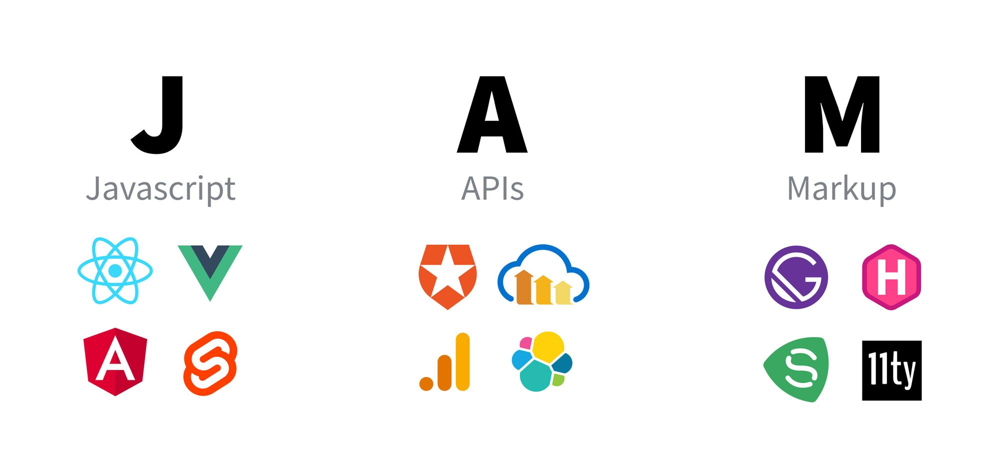
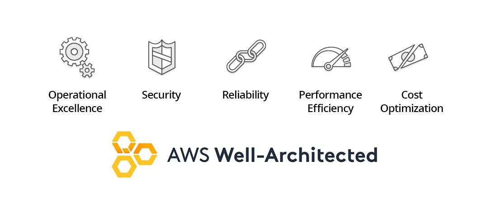

# Readings: JAM Stack

What is the JAM Stack?  https://www.freecodecamp.org/news/what-is-the-jamstack-and-how-do-i-host-my-website-on-it/
    -  JAMstack is a software architecture and philosophy that adheres to the following components: Javascript, APIs, and Markup.
    -  That React app that you compile down with Webpack and ultimately serve from S3? Yup, that’s a JAMstack app. That simple HTML file that has no JavaScript and literally doesn’t do anything dynamic? Yup, that’s also a JAMstack app.
    -  JAMstack is not always going to be serverless
    -  It's typically comprised of 3 components: Javascript, APIs, and Markup

    -  AMstack apps inherently satisfy most if not all of the 5 pillars of the AWS Well-Architected Framework. These are core concepts that AWS considers to deliver fast, secure, high-performing, resilient, and efficient infrastructure.

    - Examples of JAMstack sites:
        -  freecodecamp.org and its learning portal is a JAMstack site 
        -  impossiblefoods.com/
        -  web.dev/
    -  Some tools than can be used to build JAMstack sites or apps:
        -  App construction:
            -  11ty
            -  Gatsby
            -  Hugo
            -  Nift
            -  Scully (for you Angular fans)
            -  And many more…
        - App server:
            -  AWS
            -  Azure
            -  GCP
            -  Github Pages
            -  Netlify
            -  Surge
            -  Zeit
        - Making the app dynamic:
            -  Auth0 - Authentication
            -  Cloudinary - Media management
            -  Google Analytics - Web traffic analytics
            -  headlesscms.org - Endless list of headless CMSs
            -  Sanity - CMS
            -  Serverless Framework - DIY, easy to deploy serverless resources
            -  Snipcart - Ecommerce
            -  Stripe - Payment management
            -  And a bunch of other resources…
            -  And a bunch of other CMS choices…
            -  And some general info and tools...