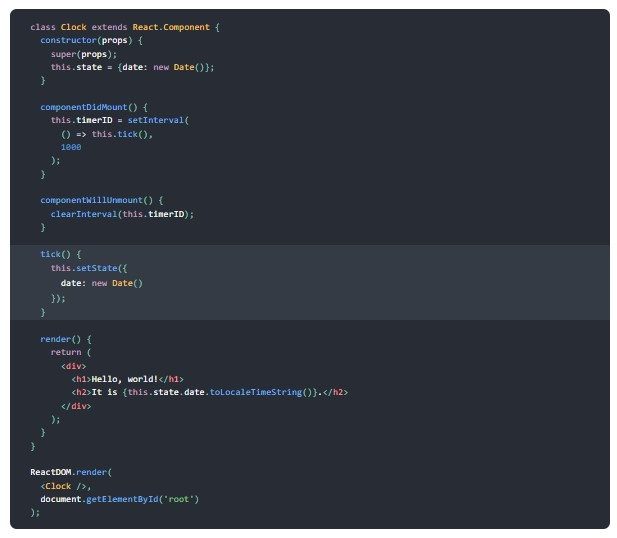
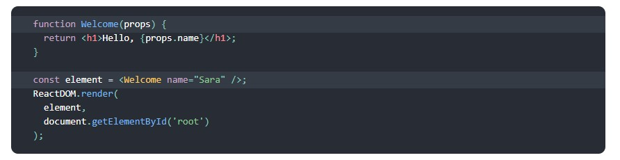

#  Readings

##  Preparation Materials
1.  making sense of hooks  https://medium.com/@dan_abramov/making-sense-of-react-hooks-fdbde8803889
    -  Hooks apply the React philosophy (explicit data flow and composition) inside a component, rather than just between the components
    -  Hooks let you always use functions instead of having to constantly switch between functions, classes, higher-order components, and render props
    -  Hooks let you use React features (like state) from a function — by doing a single function call. React provides a few built-in Hooks exposing the “building blocks” of React: state, lifecycle, and context.
    -  Hooks are fully encapsulated — each time you call a Hook, it gets isolated local state within the currently executing component
2.  the state hook  https://reactjs.org/docs/hooks-state.html
    -  Hooks don’t work inside classes. But you can use them instead of writing classes.
    -  In a class, we initialize the count state to 0 by setting this.state to { count: 0 } in the constructor
    -  In a function component, we have no this, so we can’t assign or read this.state. Instead, we call the useState Hook directly inside our component
    -  What does calling useState do? It declares a “state variable”. Our variable is called count but we could call it anything else, like banana. This is a way to “preserve” some values between the function calls — useState is a new way to use the exact same capabilities that this.state provides in a class. Normally, variables “disappear” when the function exits but state variables are preserved by React.
    -  What do we pass to useState as an argument? The only argument to the useState() Hook is the initial state. Unlike with classes, the state doesn’t have to be an object. We can keep a number or a string if that’s all we need. In our example, we just want a number for how many times the user clicked, so pass 0 as initial state for our variable. (If we wanted to store two different values in state, we would call useState() twice.)
    -  What does useState return? It returns a pair of values: the current state and a function that updates it. This is why we write const [count, setCount] = useState(). This is similar to this.state.count and this.setState in a class, except you get them in a pair. 
    -  When we want to display the current count in a class, we read this.state.count:
        -  
You clicked {this.state.count} times

    -  In a function, we can use count directly:
        -  
You clicked {count} times

    -  In a class, we need to call this.setState() to update the count state:
        -  <button onClick={() => this.setState({ count: this.state.count + 1 })}>Click me </button>
    -  In a function, we already have setCount and count as variables so we don’t need this:
        -  <button onClick={() => setCount(count + 1)}>Click me</button>
3.  hooks api  https://reactjs.org/docs/hooks-overview.html
    -  Pretty similar to last article (above)
4.  hooks api reference  https://reactjs.org/docs/hooks-reference.html
    -  Contains more info on the items below:
        -  Basic Hooks
            -  useState
            -  useEffect
            -  useContext
        -  Additional Hooks
            -  useReducer
            -  useCallback
            -  useMemo
            -  useRef
            -  useImperativeHandle
            -  useLayoutEffect
            -  useDebugValue
5.  effects hook  https://reactjs.org/docs/hooks-effect.html
    -  Article uses examples from the previous articles (above) to explain effects
    -  The Effect Hook lets you perform side effects in function components
    -  What does useEffect do? By using this Hook, you tell React that your component needs to do something after render. React will remember the function you passed (we’ll refer to it as our “effect”), and call it later after performing the DOM updates.
    -  Why is useEffect called inside a component? Placing useEffect inside the component lets us access the count state variable (or any props) right from the effect. We don’t need a special API to read it — it’s already in the function scope
    -  Does useEffect run after every render? Yes! By default, it runs both after the first render and after every update.
6.  handling events  https://facebook.github.io/react/docs/handling-events.html
    -  Handling events with React elements is very similar to handling events on DOM elements. There are some syntax differences:
        -  React events are named using camelCase, rather than lowercase.
        -  With JSX you pass a function as the event handler, rather than a string.
        -  For example, the HTML:
            -  <button onclick="activateLasers()">Activate Lasers</button>
        -  is slightly different in React:
            -  <button onClick={activateLasers}>Activate Lasers</button>
    -  Another difference is that you cannot return false to prevent default behavior in React. You must call preventDefault explicitly
7.  forms  https://facebook.github.io/react/docs/forms.html
    -  HTML form elements work a bit differently from other DOM elements in React, because form elements naturally keep some internal state
    - In HTML, form elements such as <input>, <textarea>, and <select> typically maintain their own state and update it based on user input. In React, mutable state is typically kept in the state property of components, and only updated with setState()
    -  We can combine the two by making the React state be the “single source of truth”. Then the React component that renders a form also controls what happens in that form on subsequent user input. An input form element whose value is controlled by React in this way is called a “controlled component”.
8.  state and lifecycle  https://facebook.github.io/react/docs/state-and-lifecycle.html
    -  You can convert a function component like Clock to a class in five steps:
        1.  Create an ES6 class, with the same name, that extends React.Component.
        2.  Add a single empty method to it called render().
        3.  Move the body of the function into the render() method.
        4.  Replace props with this.props in the render() body.
        5.  Delete the remaining empty function declaration.

-  Let’s quickly recap what’s going on and the order in which the methods are called:
    1.  When <Clock /> is passed to ReactDOM.render(), React calls the constructor of the Clock component. Since Clock needs to display the current time, it initializes this.state with an object including the current time. We will later update this state.
    2.  React then calls the Clock component’s render() method. This is how React learns what should be displayed on the screen. React then updates the DOM to match the Clock’s render output.
    3.  When the Clock output is inserted in the DOM, React calls the componentDidMount() lifecycle method. Inside it, the Clock component asks the browser to set up a timer to call the component’s tick() method once a second.
    4. Every second the browser calls the tick() method. Inside it, the Clock component schedules a UI update by calling setState() with an object containing the current time. Thanks to the setState() call, React knows the state has changed, and calls the render() method again to learn what should be on the screen. This time, this.state.date in the render() method will be different, and so the render output will include the updated time. React updates the DOM accordingly.
    5. If the Clock component is ever removed from the DOM, React calls the componentWillUnmount() lifecycle method so the timer is stopped.

    -  There are three things you should know about setState():
        1.  Do Not Modify State Directly
        2.  State Updates May Be Asynchronous
        3.  State Updates are Merged

9.  components and props  https://facebook.github.io/react/docs/components-and-props.html
    -  Components let you split the UI into independent, reusable pieces, and think about each piece in isolation
    -  The simplest way to define a component is to write a JavaScript function

-  Let’s recap what happens in this example:
    1.  We call ReactDOM.render() with the <Welcome name="Sara" /> element.
    2.  React calls the Welcome component with {name: 'Sara'} as the props.
    3.  Our Welcome component returns a <h1>Hello, Sara</h1> element as the result.
    4.  React DOM efficiently updates the DOM to match <h1>Hello, Sara</h1>.