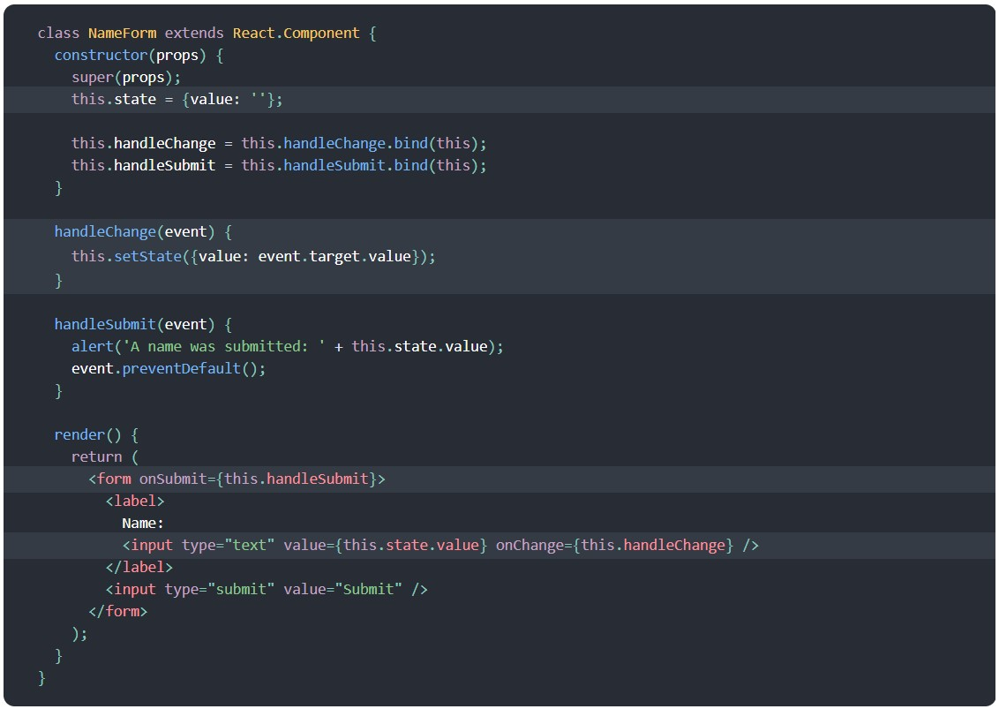
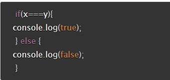

#  Readings: React and Forms

##  Reading

### React Docs - Forms (https://reactjs.org/docs/forms.html)
1.  What is a ‘Controlled Component’?
    -  You can have a form in react accept information and it just will.  BUT, if you want it to store it so that you have access to it, then you use a controlled component
    -  In React, mutable state is typically kept in the state property of components, and only updated with setState().
    -  The React component that renders a form also controls what happens in that form on subsequent user input. 
    -  An input form element whose value is controlled by React in this way is called a “controlled component”.
    -  For example, if we want to make the previous example log the name when it is submitted, we can write the form as a controlled component:
    

2.  Should we wait to store the users responses from the form into state when they submit the form OR should we update the state with their responses as soon as they enter them? Why.
    - As soon as information is entered, it changes the state and the information is updated
3.  How do we target what the user is entering if we have an event handler on an input field?
    -  By using target.  EX.

class Reservation extends React.Component {
  constructor(props) {
    super(props);
    this.state = {
      isGoing: true,
      numberOfGuests: 2
    };

    this.handleInputChange = this.handleInputChange.bind(this);
  }

  handleInputChange(event) {
    const target = event.target;
    const value = target.type === 'checkbox' ? target.checked : target.value;
    const name = target.name;

    this.setState({
      [name]: value
    });
  }

  render() {
    return (
      <form>
        <label>
          Is going:
          <input
            name="isGoing"
            type="checkbox"
            checked={this.state.isGoing}
            onChange={this.handleInputChange} />
        </label>
         
        <label>
          Number of guests:
          <input
            name="numberOfGuests"
            type="number"
            value={this.state.numberOfGuests}
            onChange={this.handleInputChange} />
        </label>
      </form>
    );
  }
}

### The Conditional (Ternary) Operator Explained (https://codeburst.io/javascript-the-conditional-ternary-operator-explained-cac7218beeff)
1.  Why would we use a ternary operator?
    -  Syntax:  condition ? value if true : value if false  Ex:  person.driver = person.age >=16 ? 'Yes' : 'No';
        1.  The condition is what you’re actually testing. The result of your condition should be true or false or at least coerce to either boolean value.
        2.  A ? separates our conditional from our true value. Anything between the ? and the : is what is executed if the condition evaluates to true.
        3.  Finally a : colon. If your condition evaluates to false, any code after the colon is executed.
    -  Based on the title of the article:  Shorten your if statements into one line of code with the conditional operator
2.  Rewrite the following statement using a ternary statement:  
  
  
  xy = x===y ? console.log(true) : console.log(false);
  
##  Bookmark/Skim
-  React Bootstrap - Forms (https://react-bootstrap.github.io/components/forms/)
-  React Docs - conditional rendering (https://reactjs.org/docs/conditional-rendering.html)

##  What do I want to learn more about?
