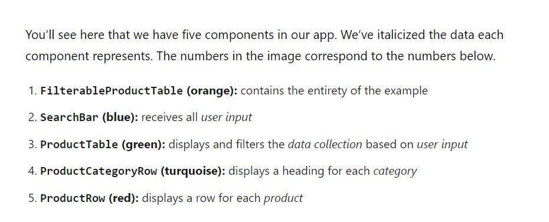

#  Readings: Putting it all together

##  Reading

###  React Docs - thinking in React  (https://reactjs.org/docs/thinking-in-react.html)
1.  How would you break a mock into a component heirarchy?
    Example:  
     
      
    -  FilterableProductTable
        -  SearchBar
        -  ProductTable
            -  ProductCategoryRow
            -  ProductRow

2.  What is the single responsibility principle and how does it apply to components?
    -  A component should ideally only do one thing. If it ends up growing, it should be decomposed into smaller subcomponents
3.  What does it mean to build a ‘static’ version of your application?
    -  A version that takes your data model and renders the UI but has no interactivity
4.  Once you have a static application, what do you need to add?
    -  
5.  What are the three questions you can ask to determine if something is state?
    1.  Is it passed in from a parent via props? If so, it probably isn’t state.
    2.  Does it remain unchanged over time? If so, it probably isn’t state.
    3.  Can you compute it based on any other state or props in your component? If so, it isn’t state.
6.  How can you identify where state needs to live?
    -  For each piece of state in your application:
        -  Identify every component that renders something based on that state.
        -  Find a common owner component (a single component above all the components that need the state in the hierarchy).
        -  Either the common owner or another component higher up in the hierarchy should own the state.
        -  If you can’t find a component where it makes sense to own the state, create a new component solely for holding the state and add it somewhere in the hierarchy above the common owner component.

## Things I want to know more about