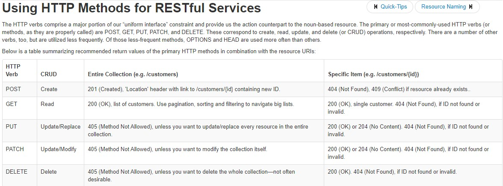

#  Readings: APIs

##  Reading

###  API Design Best Practices (https://docs.microsoft.com/en-us/azure/architecture/best-practices/api-design)
1.  What does REST stand for?
    -  Representational State Transfer (REST)
2.  REST APIs are designed around a <em>resources</em>.
3.  What is an identifer of a resource? Give an example.
    -  A resource has an identifier, which is a URI that uniquely identifies that resource. For example, the URI for a particular customer order might be:  https://adventure-works.com/orders/1
4.  What are the most common HTTP verbs?
    -  GET, POST, PUT, PATCH, and DELETE
5.  What should the URIs be based on?
    -  When possible, resource URIs should be based on nouns (the resource) and not verbs (the operations on the resource)
6.  Give an example of a good URI.
    -  https://adventure-works.com/orders // Good
    -  https://adventure-works.com/create-order // Avoid
7.  What does it mean to have a ‘chatty’ web API? Is this a good or a bad thing?
    -  Another factor is that all web requests impose a load on the web server
    -  The more requests, the bigger the load
    -  Therefore, try to avoid "chatty" web APIs that expose a large number of small resources
    -  Such an API may require a client application to send multiple requests to find all of the data that it requires.
8.  What status code does a successful GET request return?
9.  What status code does an unsuccessful GET request return?
10.  What status code does a successful POST request return?
11.  What status code does a successful DELETE request return?

###  Bookmark/Skim
-  RegExr - Pay particular attention to the cheatsheet (https://regexr.com/)
    -  How would you match your name using RegEx?  /yvette\b/g
-  Regex Tutorial (https://medium.com/factory-mind/regex-tutorial-a-simple-cheatsheet-by-examples-649dc1c3f285)
-  Regex 101 (https://regex101.com/)